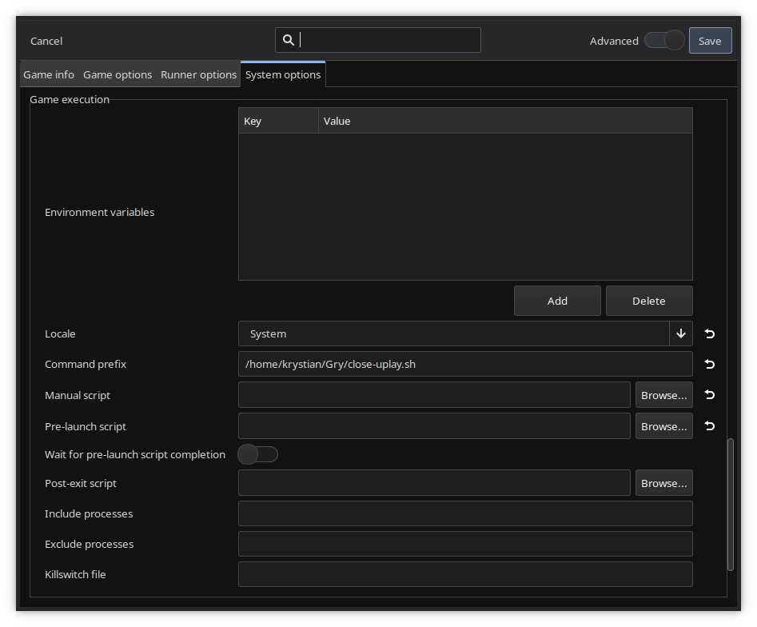
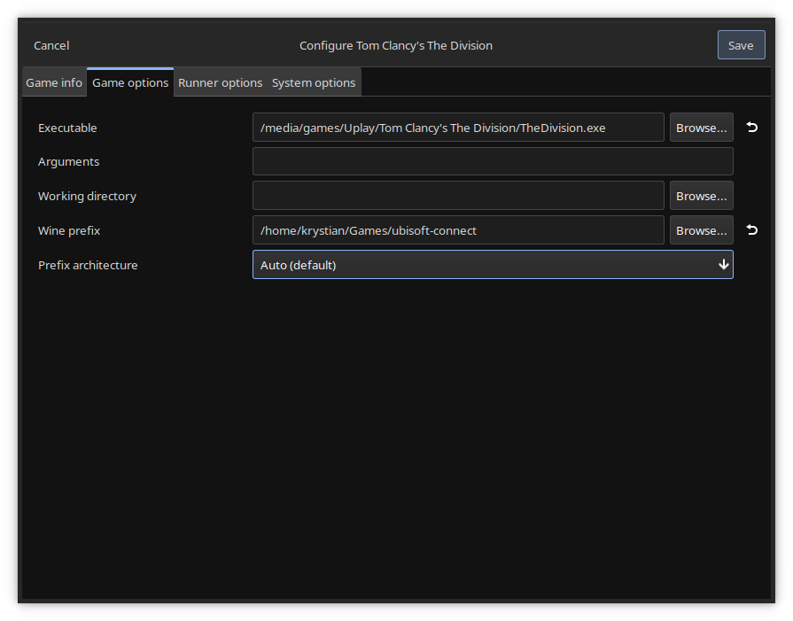

# Uplay Closer
A bash script that exits Uplay after game exits.

## How to use
Just download the script and run it like this:
```bash
chmod +x close-uplay.sh
./close-uplay.sh wine /path/game.exe
```
## Using with Lutris
You can easily use the script with Lutris.\
Just paste the script path into the `Command prefix` field.



For this to work, you must provide the path
to the game executable instead of the Ubisoft Connect.


